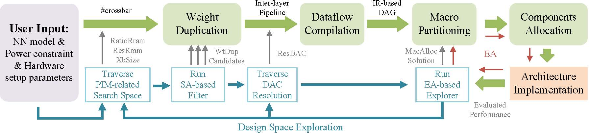
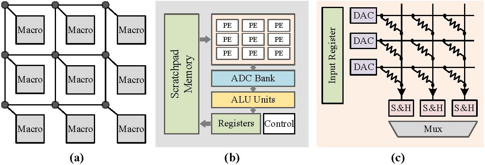

# PIMSYN-NN
## Overview



PIMSYN-NN is a full-stack automatic synthesis framework for PIM-based CNN accelerators. It
realizes a one-click transformation from CNN applications to PIM architectures.

PIMSYN-NN requires users to input
- ONNX-format CNN model
- Total power constraint
- Hardware setup parameters

Through a series of synthesis stages together with the integrated DSE flow, PIMSYN-NN automatically generates the architecture of a PIM-based accelerator with maximized power efficiency. The generated solution also specifies computation dataflow, i.e., when and where each computation task is performed. 

To be mentioned, the CNN model has well been designed, trained, and quantified, and is an input of PIMSYN. Hardware synthesis will not cause extra accuracy loss for given CNN algorithms.

[PIMCOMP-NN](https://github.com/sunxt99/PIMCOMP-NN) and [pimsim-nn](https://github.com/wangxy-2000/pimsim-nn) are two other projects related to PIMSYN-NN. PIMCOMP-NN is a compilation optimization framework designed for crossbar-based PIM DNN accelerators. And, pimsim-nn is a simulator designed for RRAM-/PIM-based neural network accelerators. The three projects together form a PIM design toolchain. PIMCOMP-NN can further realize compilation optimization for accelerators synthesized by PIMSYN-NN.

## Architecture Abstraction



PIMSYN-NN generates PIM-based CNN accelerators based on the above PIM-oriented architecture abstraction. It is composed of a three-level macro-PE-crossbar hierarchy. The architecture abstraction is
compatible with most previous works. In PIMSYN-NN, all the above components are configurable and parameterizable to enable a comprehensive DSE.


## Requirements

The project needs run in Python3, and you need to install the following python packages.

- onnx
- onnxruntime
- numpy
- tqdm

## Usage

### Parameter

| Parameters             | Description                                                                | Comment           |
| -----------------------|----------------------------------------------------------------------------|-------------------|
| --onnx_path            |Specify the path of neural network onnx file                                |                   |
| --network              |Specify the output path of onnx2json frontend                               |                   |
| --total_power          |Specify the peak power limitation                                           | Watt              |
| --macro_setting        |Identical macros across all layers or customized macros for different layers| unified/specified |
| --config               |Specify configuration file path                                             |                   |
| --macro_reuse          |Whether enable inter-layer macro sharing                                    | True/False        |
| --output               |Output file path                                                            |                   |
| --pimcomp              |The path of input arguments for PIMCOMP                                     |                   |

Users can download ONNX model from [ONNX Model Zoo](https://github.com/onnx/models) and save the model to `PIMSYN-NN/models/ONNX/`. PIMSYN-NN adopts the frontend program same as [PIMCOMP-NN](https://github.com/sunxt99/PIMCOMP-NN). The output json file of frontend will be saved in `PIMSYN-NN/models/JSON/`. In order to facilitate users to use PIMSYN-NN, we have converted some commonly used network models into json files in advance and users can directly use them as below.

```shell
cd PIMSYN-NN
python main.py  --network ./models/JSON/alexnet.json --total_power 49 --macro_setting specified --config config.json --macro_reuse True --output ./output/alexnet.json --pimcomp ./output/alexnet_pimcomp.json
```

or

```shell
python main.py --onnx_path ./models/ONNX/resnet18.onnx --network ./models/JSON/resnet18.json --total_power 49 --macro_setting specified --config config.json --macro_reuse True --output ./output/resnet18.json --pimcomp ./output/resnet18_pimcomp.json
```

### PIMSYN-NN configuration

The hardware setup parameters are configured in `config.json`.
`config.json` also defines some DSE parameters of PIMSYN-NN.

## Citing PIMSYN-NN

[1] Wanqian Li, Xiaotian Sun, Xinyu Wang, Lei Wang, Yinhe Han, Xiaoming Chen, ["PIMSYN: Synthesizing Processing-in-memory CNN Accelerators"](https://github.com/lixixi-jook/PIMSYN-NN/tree/main/doc/date24.pdf), in Design, Automation and Test in Europe Conference, 2024. [[Bibtex](https://github.com/lixixi-jook/PIMSYN-NN/tree/main/doc/bibtex.txt)] [[ArXiv](https://arxiv.org/abs/2402.18114)]

## Code Author

[Wanqian Li](liwanqian20s@ict.ac.cn) (Institute of Computing Technology, Chinese Academy of Sciences)

## Project PI

[Xiaoming Chen](https://people.ucas.edu.cn/~chenxm)

## License

[Apache License v2.0](LICENSE)

## Acknowledgements

[onnx](https://github.com/onnx/onnx)
